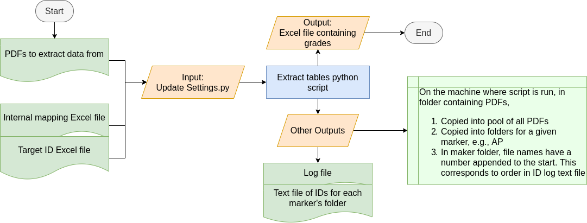

# Extract Tables from PDF 

According to internal specifications, this script:
1. Extracts key information from tables in a pdf
2. Structures information for an excel workbook
3. Produces an excel workbook as output

This does not always result in the "correct" result due to the inconsistency and variety of the input pdfs.
Therefore, this has been written to account for the fact that it will fail at points. The aim is to capture the
most commonly occuring cases to reduce the overall workload.

## Core Dependency  

This requires Python 3. It was developed in Python 3.7 and 3.8 so the known minimum is Python 3.7+

This utilises the python package [tabula-py](https://tabula-py.readthedocs.io/en/latest/tabula.html) to read tables within
a pdf. As this package is a python wrapper of [tabula-java](https://github.com/tabulapdf/tabula-java), has [java as a dependency](https://pypi.org/project/tabula-py/).

Why [Tabula](https://tabula.technology/) and not [Camelot](https://camelot-py.readthedocs.io/en/master/index.html)? The pdfs to be analysed resulted in Camelot throwing an error while Tabula did not. 

## Installation  

Installation can be broken down into three main steps:
  1. Download the code base
  2. Installing the Python packages this repo is dependent on
  3. Installing the dependencies of Tabula
After that, you're good to go!

*N.B. on Operating System:* This was developed in Linux (Ubuntu 18.04) and has not been tested in any other operating system.

### Download the Code Base  

This should be relatively painless. There are a couple of ways to do this,
  - Using git clone. Go to the folder you want to download into, then run this command
      ```
      git clone https://github.com/IDEA-lab-IC/extract_tables.git
      ```
  - Download the zip file
  - Click the Green download code button 

### Setting up Python environment  

There are two ways to set up the Python environment - using [pip](https://pypi.org/project/pip/) or [Conda](https://github.com/conda/conda) to download the required Python packages. 

For Conda installation, [environment.yml](environment.yml) contains the requirements needed to (hopefully) recreate the environment this was developed in.
  1. Use the terminal or anaconda prompt to run 
       ```
       conda env create -f environment.yml
       ```
     This should automatically create the Conda environment. For further details/help, please refer to the Conda guide on [creating an environment](https://docs.conda.io/projects/conda/en/latest/user-guide/tasks/manage-environments.html#creating-an-environment-from-an-environment-yml-file)
  2. To activate the envronment, 
       ```
       conda activate extract_pdf
       ```
  3. The `environment.yml` should capture the packages only in the pip distribution. The method used to achieve this is from [here](https://stackoverflow.com/questions/35245401/combining-conda-environment-yml-with-pip-requirements-txt). 
  4. If in doubt, ask Google. 

For pip installation, [requirements.txt](requirements.txt) is the `environment.yml` equivalent. For further dtails on pip, refer to their [documentation](https://pip.pypa.io/en/stable/getting-started/).
  1. In the terminal, run 
       ```
       pip install -r requirements.txt
       ```
  2. This should have all the requirement packages installed. If in doubt, this [post](https://stackoverflow.com/questions/29980798/where-does-pip-install-its-packages) is quite helpful to understand where pip has installed it to.

### Install Tabula Dependencies  
 
Tabula requires Java 8+. I think [this](https://www.oracle.com/java/technologies/javase-jre8-downloads.html) is the link to download it. 

If using Tabula on Windows 10, their documentation contains a useful [page](https://tabula-py.readthedocs.io/en/latest/getting_started.html#get-tabula-py-working-windows-10) 
on how to get it to work.


## How to use?  

### Overview

The diagram below provides an overview of the inputs required for the script as well as the outputs produced.
The main output of this script is the excel file containing the grades extracted from the PDFs. 
Further details on each of the components will be provided in the following sections.



### User Inputs

As an output of this script involves copying the PDF files from one location to another, it is important that the ouput paths exists. 
It had been intended that the script would automatically create the output path if it did not exist. 
However, due to time constraints on the project and the unexpected difficulties in achieving this. 
This feature was not implemented. 
Moreover, this could be a sanity check for the user to ensure that the output location has been correctly specified in [settings.py](settings.py).

__IMPORTANT__: An implicit assumption made is that the IDs do not contain a leading 0. 
If it does, this will be dropped. This dropping occurs when the ID is converted to an integer. 
If the leading zero is required, change within [utils.py](utils.py) that the type enforced should be `str` instead of `int`.

What are the inputs and what are the used for?
1. PDFs to extract data from
   - These are the PDFs in which the data to be extracted reside in. It is assumed that this data are all in tables.
   - All these files must sit within a single folder
   - The path to this folder must be provided in the [settings.py](settings.py) file
   - Certain assumptions have been made about the structure and layout of these files. Further details on this can be found in section below on maintaining this script.
   - The structure of the filename has been assumed to be as follows: `<text>_<text>_IDNumber_unicode.pdf`. The ID number for each PDF is extracted from here.
   - If duplicates exist, they will be ignored.
2. Internal mapping excel file
   - This file contains what the strings (qualification names) in the PDFs maps to the string used within the master excel.
   - The structure is as follows:
     - First column - String that is used within the master excel.
     - Subsequent columns - Strings found in the PDFs. There can be multiple, more columns just need to be populated.
     - No headers
3. Target ID Excel file
   - This contains all the IDs which the data will be extracted for.
   - The values here _must_ correspond to the the ID numbers extracted from the PDF filenames. If this is not the case, the script will raise an error and terminate execution.
   - __IMPORTANT__: The order of the IDs in the output Excel file will match the order provided in this file. For the order of the IDs, in the folder for each marker, to correspond to the what appears in _master_, the order provided must correspond to the internal source sheet. 
   - The assumed structure is that: 1) No headers, 2) IDs are all placed within a single column.
   - This almost equivalent to a csv file. However, to remain consistent with the other inputs being an excel file. 
4. [settings.py](settings.py)
   - Besides updating the path to the input files, name of the output files, and path to the output location; administrative allocation information _must_ be provided here.
   - The allocation information _necessary_ for the master excel.
   - What is the allocation information?
     - Batch number: (Integer) Which batch this corresponds to. This must be incremented after each batch. 
     **It is assumed in the later analytics that this number is unique and keeps increasing even after a cycle is complete.
     Please do NOT RESTART the COUNT after a cycle is complete**
     - Cycle: (String) Which application cycle these IDs fall into. This will be either Nov or Jan and only needs to be updated after a cycle is complete.
     - Allocation Details: (Dictionary) Contains the initials of each marker (N.B. assumed to be 2 characters long) in the key and the ratio in the value. E.g.1, if the IDs are to be evenly distributed, then AP:TM:EN will be 1:1:1, 
     `allocation_details = {
          "AP": 1,
          "TM": 1, 
          "EN": 1,
      }`. 
      E.g.2, if IDs are to be unevenly distributed due to a lack of availability, then the ratio (AP:TM:EN) could be 2:0:1, 
      `allocation_details = {
          "AP": 2,
          "TM": 0, 
          "EN": 1,
      }`.
      Here, TM will not be allocated any IDs and AP will have double that of EN.

#### Input Update

##### Assumptions
1. Banner file is input
    - Replaces target_ids excel file
    - Contains all previous and new IDs
2. Treat banner file as the “ground truth”
    - Implication: IDs from pdf files are a subset of IDs from the banner file
    - Therefore, behaviour of the code should be
        1. If an ID from the PDFs is found, __terminate__ – throw InvalidInput error
        2. If a new ID is not amongst the PDF IDs, __terminate__
 

##### Definition of new ID
An ID is new if,
1. Exists in banner file
2. Not exist in existing IDs

The new ID set is the difference between the set of banner IDs and the set of database IDs.

 
##### What is the database?

CSV file that contains,
1. IDs
2. Associated batch number
 

##### What the code will do?
1. Gets all the IDs from the PDFs
2. Get IDs from banner file
3. Get IDs from database
    1. Check if database exists – Create if it doesn’t, read if it does
    2. Find the largest previous batch number
        1. Print to line previous (largest in database) batch number and current batch number from settings
        2. If they are the same, behaviour depends on `settings.terminate_if_batch_num_repeated` variable. If `True`, it will __terminate__. This is to ensure that the order of the PDFs in the individual marker folders is “correct”. If `False`, user input is required. This is useful if getting of previous IDs is used in a different context.
4. Find new IDs using set definition
5. Check correspondence between new IDs and those in PDF folder. __Terminate__ is any of the above assumptions are violated
 

##### When is database updated?

It is the last “action” before the script ends

##### Additional settings to configure

For target ids file:
```py
  # The standard settings fall into two cases

  # Case 1: File is banner
  is_id_file_banner = True
  is_banner_cumulative = True
  which_column = "F"

  # Case 2: File is not banner
  is_id_file_banner = False
  is_banner_cumulative = False
  which_column = None

  # A less standard setting would be 
  # Please refer to the testing module (testing.py) to understand the implications or to the section below on "What behaviour is defined and what happens?"
  is_id_file_banner = True
  is_banner_cumulative = False
```

For database file:
```py
  # Vars that don't need changing:
  database_headers = ["ID No.", "Batch No.", "Timestamp"]
  database_header_id_num_index = 0
  database_header_batch_index = 1
  database_header_timestamp_index = 2

  # Case 1: With database
  database_of_extracted_pdfs = "previously_extracted.csv"
  path_to_database_of_extracted_pdfs = get_full_file_path(
      os.path.join(".", "data"), database_of_extracted_pdfs
  )

  # Case 2: Without database
  database_of_extracted_pdfs = None
  path_to_database_of_extracted_pdfs = None
```

For batch number condition:
```py
  # To terminate
  terminate_if_batch_num_repeated = True
  # To require user input
  terminate_if_batch_num_repeated = False
```

##### What behaviour is defined and what happens?
The following assume banner is target ID file and the associated PDF is present, 

1. Target ID file is _not_ cumulative and _no_ database is present
    - Extract all IDs that are in target ID file 
2. Target ID file _is_ cumulative and _no_ database is present
    - If batch number is 1, extract all IDs that are in target ID file 
    - If batch number is _not_ 1, fails. No database but it is cumulative implies there is insufficient information or settings are incorrect
3. Target ID file is _not_ cumulative and database _is_ present
    - If database and target are disjoint, then succeed as target is truth
    - If database intersects target, then remove database IDs from target 
    - If database superset of target, then fails
4. Target IDs is identical to database IDs
    - Fails as there are no new IDs
5. Target ID file _is_ cumulative and database _is_ present
    - Typical use case
    - Extracts new IDs

### Script Output

The main output is the excel file containing the grades. 
It has been structured for use in the `Grades Source sheet` of the Master Excel. 
Hence, this should be relatively straightforward as it is designed to be copy and pasted in there.

What's in?
1. Log file
    - Contaings logging information with respect to loading the PDFs. Nothing beyond that. Further information could've been provided but internal requirements indicated a preference for it to only contain that. 
    - It has been set up such that a new log file is created each time the script is executed (instead of appending to the existing log file).
    - It will contain information on why a given file was rejected (not included in PDFs to extract data from) and if any (and how many) duplicates are present.
    - If a duplicate is present, the following information is provided: 1) ID number, 2) Absolute path to file.
2. PDF file copying
    - Upon consulting end users, it was desired that once the script has successfully executed, the PDFs should be moved into a general pool containing PDFs from earlier batches. However, as moving cannot be undone, a safer solution of copying was implemented.
    - For ease of the end user, it was desired that the PDFs for a given applicant be placed in a folder for the corresponding marker. 
      - Within a marker's folder, contains all of the PDFs that have been assigned to the marker. 
      The naming has also been made such that the order will correspond to the order within the output excel file for ease of use. 
      - Within the folder also contains a text file, the text file will contain the IDs that have been assigned to the marker and can be used to check and ensure correspondence. 


### Executing the Script

Once these have been sorted, the script can be run in the terminal, 
  ```
  python extract_table.py
  ```
This will execute the script and a progress bar will print on a single line.
Upon sucessful execution, the outputs will be generated in the locations specified in [settings.py](settings.py).


## How has this been structured? 

`extract_table.py` coordinates the whole table extraction. It iterates over all files in the folder provided. 
- The extracted information for each pdf is stored in an instance of the object `ExtractedStudents()`
- For each file, starting from the 2nd page, the tables are extracted by `tablula.read_pdf()` into a `Pandas Dataframe`. 
  - For a given page, the tables in the page are checked to identify it is a target table or if it is the last table in the pdf 
    - If it is a target table, then it is checked for being split over two pages and a fix is applied accordingly.
    - If it is the last table, the exit condition is triggered
  - Once the exit condition is triggered, 
    - An instance of `Student()` is created with extracted tables
    - Instance is added to `ExtractedStudents()` object
  - If the exit condition is not triggered, but instead the end of file (eof) is encountered. Then, this is handled by the exception. In the handling, the extracted information is stored in the same manner as if the exit condition was triggered. 
- Once all files have been processed, the `ExtractedStudents()` object is called to write the information to an excel file.  

`student.py` is where all the logic and actual processing occurs. There are three classes within this. 
  1. `ExtractedStudents()`
      - It can be viewed as being the highest level. An analogy of this would be this manages the entire cohort of students studying a given course.
      - This class coordinates the overall management of every instance of `Student()` that belongs to it 
  2. `Student()`
      - An analogy for this would be an individual student studying a given course. This student will have grades in different subjects and each of these need to be stored, sorted and verified.
      - This class handles all the complexity involved in storing and extracting relevant information for a given pdf. 
  3. `GradeEntry()`
      - It can be viewed as being the lowest level. 
      - It only contains key information related to a given data entry (row in a table). 
      - This information could have simply be stored in a dictionary or a list instead. However, this method was adopted with the aim of improving the readability of the code.

`utils.py` contains the useful functions (utilities) and functions that store strings needed to extracting information.

## How to maintain?

### I can't get Tabula to work, but Camelot does! 

Feel free to use Camelot instead. 
Just ensure that at the two call of Tablua (one in `extract_table.py`, another in `check_broke_table()` function in `utils.py`) are replaced with Camelot.
Camelot does not natively return a pandas dataframe (like Tabula) so you'll need to add a `.df` at the end and it should be compatible!

### The pdf tables have changed, what do I do? 

The code works by testing the strings in the table against the a set of "desired strings". 
Therefore, all that needs to be changed are the desired strings. 
These lie within the functions in `utils.py`. 

The strings within those functions is the only places that need to updated in accordance to how the pdfs have changed. 

The functions that will need updating are from line 277 onwards. 
### I want my ID numbers to contain a leading 0, what do I do?
As mentioned in the section above, the type needs to changed from `int` to `str`. 
If the leading zero is required, change within [utils.py](utils.py) that the type enforced should be `str` instead of `int`.
In general, I would advise not to use the ID with a leading 0 as it can lead to issues even in excel. 
Another potential case would be the zero being dropped during the loading from the excel file. 
In this case, instituite a check during the loading phase then prepend a `"0"` to the ID as a `str`. 


## To Do  

- [ ] Refactor!
- [ ] Implement testing. This really should've been done during development
- [ ] Create path if it does not exist
- [ ] Create the foolproof but unmaintanable beast of an exe file 


